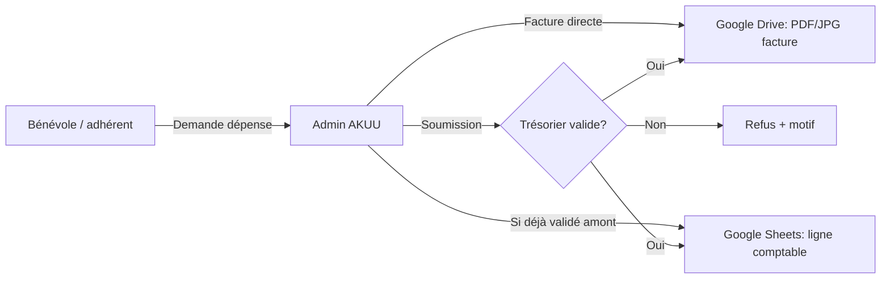

# Architecture cible — Options pro

> Choix à valider via `QUESTIONS-REFINEMENT.md` (questions 1, 2, 15, 16, 17).

---

## Besoin fonctionnel (résumé)

---

## Option A · Google Apps Script (recommandée NGO petit budget)

| Avantages | Inconvénients |
|-----------|---------------|
| Pas de serveur à payer | Quotas Google |
| Drive + Sheets natifs | JS Google Apps Script moins ergonomique |
| Auth Google Workspace | Dépendance compte Google asso |

**Pattern :**
- Frontend Vue appelle `POST https://script.google.com/macros/s/.../exec`
- Apps Script : upload fichier Drive, append row Sheets, envoi email trésorier
- Auth : Google OAuth ou token session émis par Apps Script après login mot de passe asso

---

## Option B · Backend léger (Supabase / Firebase)

| Avantages | Inconvénients |
|-----------|---------------|
| Auth + RLS robustes | Coût / complexité |
| Storage fichiers | Sync Sheets à coder |
| API propre | Deux sources de vérité si Excel reste master |

**Pattern :** Supabase Auth + Storage + Postgres · export périodique vers Sheets ou remplacement Excel

---

## Option C · Make / Zapier + formulaire

| Avantages | Inconvénients |
|-----------|---------------|
| Rapide sans dev backend | Moins intégré au site |
| Peu de code | Coût abonnement · moins de contrôle UX |

---

## Recommandation provisoire (en attente vos réponses)

**Phase 1 :** UI admin Vue + auth simple + mock API  
**Phase 2 :** Google Apps Script Web App + dossier Drive structuré + onglet Sheets aligné sur `finances-ag.json`

---

## Champs comptables minimum (facture validée)

| Champ | Obligatoire | Notes |
|-------|-------------|-------|
| Date de dépense | Oui | |
| Date de saisie | Auto | |
| Montant PEN | Oui | Soles |
| Montant EUR | Non | Taux du jour ou saisie manuelle |
| Catégorie comptable | Oui | Liste alignée bilans |
| Projet AKUU | Oui | Musée, Hydrama… |
| Libellé / description | Oui | |
| Lieu | Recommandé | Pérou / France |
| Payé par | Oui | Nom bénévole · carte perso · compte asso |
| Moyen de paiement | Oui | Espèces, CB, virement, PayPal… |
| Validé amont trésorier | Checkbox | Votre spec |
| Pièce jointe facture | Oui | Photo/PDF |
| N° facture fournisseur | Si dispo | |
| Fournisseur | Recommandé | |
| TVA / déductible | Si France | |
| Statut | Auto | brouillon · en attente · validé · refusé |
| Validé par (trésorier) | Auto | |
| Commentaire trésorier | Si refus | |

---

## Rôles utilisateur (proposition)

| Rôle | Droits |
|------|--------|
| `member` | Demande de dépense · voir ses demandes |
| `volunteer` | + saisir facture si validé amont |
| `treasurer` | Valider/refuser · voir toutes · export |
| `admin` | Gérer utilisateurs · catégories |
