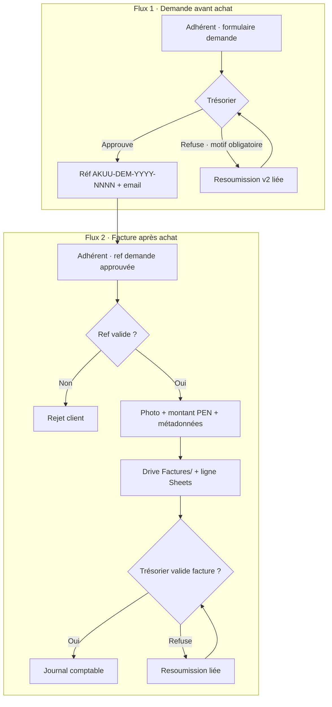
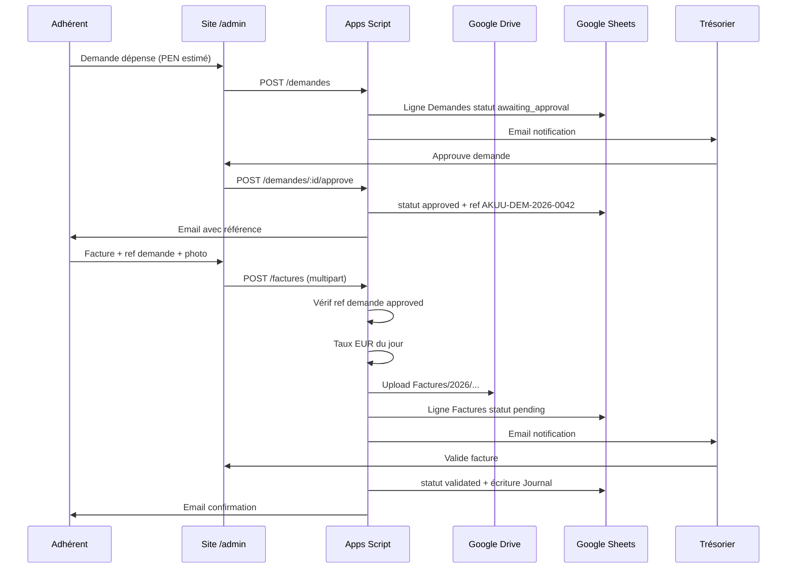

# Spec API & workflow — Admin trésorerie AKUU

> **Statut :** spec figée · Phase A (frontend + mock) · Phase B (Apps Script)  
> Compte Google : `akuu.asso@gmail.com`  
> Drive racine : [2026_NEW_Protocol](https://drive.google.com/drive/folders/1hAisydbVLOWUztBxi6XRCeGlrb8vBeSX) · ID `1hAisydbVLOWUztBxi6XRCeGlrb8vBeSX`

---

## 0. Diagramme workflow métier (v1)



**Règle absolue :** une facture sans `AKUU-DEM-…` au statut `approved` est rejetée (client + serveur).

---

## 1. Workflow global (séquence technique)



---

## 2. Références métier

| Type | Format | Exemple |
|------|--------|---------|
| Demande | `AKUU-DEM-{YYYY}-{NNNN}` | `AKUU-DEM-2026-0042` |
| Facture | `AKUU-FAC-{YYYY}-{NNNN}` | `AKUU-FAC-2026-0103` |

- Numérotation séquentielle par année (Sheets compteur)
- Email d’approbation demande **doit contenir** la référence en sujet : `[AKUU-DEM-2026-0042] Demande approuvée`

---

## 3. Google Sheets · `AKUU_Comptes_Depenses`

Créer dans `Comptes/` sous le dossier Drive.

### Onglet `Demandes`

| Colonne | Description |
|---------|-------------|
| id | UUID |
| reference | AKUU-DEM-… |
| created_at | ISO |
| submitter_email | |
| project | code |
| category | code |
| amount_pen_estimated | |
| amount_eur_estimated | auto |
| exchange_rate | auto |
| payment_type | avance_benevole / … |
| description | |
| needed_by_date | |
| status | awaiting_approval / approved / rejected / cancelled |
| treasurer_email | |
| decided_at | |
| reject_reason | |
| resubmission_of | id parent si resoumission |
| version | 1, 2, 3… |

### Onglet `Factures`

| Colonne | Description |
|---------|-------------|
| id | UUID |
| reference | AKUU-FAC-… |
| demand_reference | **obligatoire** AKUU-DEM-… |
| created_at | |
| expense_date | |
| submitter_email | |
| project | |
| category | |
| amount_pen | |
| amount_eur | auto |
| exchange_rate | auto |
| exchange_source | ex. ECB · 2026-09-28 |
| payment_type | |
| payment_method | |
| paid_by | |
| vendor_name | |
| receipt_number | |
| location | |
| label | |
| status | pending / validated / rejected |
| drive_file_id | |
| drive_file_url | |
| treasurer_email | |
| validated_at | |
| reject_reason | |
| resubmission_of | |

### Onglet `Journal` (écritures validées)

Copie des factures `validated` + champs export compta · alimente futur `finances-ag.json`.

### Onglet `Audit`

| timestamp | actor_email | action | entity_type | entity_id | payload_json |

### Onglet `Config`

| key | value |
|-----|-------|
| ROOT_FOLDER_ID | 1hAisydbVLOWUztBxi6XRCeGlrb8vBeSX |
| FACTURES_FOLDER_ID | (créé par script) |
| DEM_COUNTER_2026 | 42 |
| FAC_COUNTER_2026 | 103 |
| TREASURER_EMAILS | email1@, email2@ |
| WHITELIST | (ou fichier séparé PropertiesService) |

---

## 4. Apps Script Web App

### Endpoints (POST JSON sauf upload)

| Route | Auth | Description |
|-------|------|-------------|
| `POST /auth/login` | public | email + password → JWT session |
| `POST /auth/google` | public | Google ID token → JWT si whitelist |
| `GET /auth/me` | user | profil + rôle |
| `POST /demandes` | member | créer demande |
| `GET /demandes/mine` | member | mes demandes |
| `GET /demandes/pending` | treasurer | file attente |
| `POST /demandes/:ref/approve` | treasurer | approuve + email ref |
| `POST /demandes/:ref/reject` | treasurer | motif obligatoire |
| `POST /demandes/:ref/resubmit` | member | nouvelle version |
| `POST /factures` | member | multipart photo + JSON |
| `GET /factures/pending` | treasurer | |
| `POST /factures/:ref/validate` | treasurer | → Journal |
| `POST /factures/:ref/reject` | treasurer | |
| `GET /exchange-rate/pen-eur` | user | taux du jour cache 24h |
| `GET /history` | treasurer | tout · member = siens |

### Sécurité

- JWT signé HMAC · secret dans `PropertiesService` Apps Script
- Whitelist emails : `ScriptProperties WHITELIST_JSON`
- Rôle `treasurer` si email dans `TREASURER_EMAILS`
- CORS : domaine prod AKUU + localhost dev

### Trigger relance 24h

```javascript
function sendPendingReminders() {
  // Demandes awaiting_approval > 24h → email trésoriers
  // Factures pending > 24h → idem
}
```

Planifier trigger horaire Apps Script.

---

## 5. Taux de change PEN → EUR

1. Apps Script `UrlFetchApp` vers API publique (ex. [Frankfurter ECB](https://api.frankfurter.app/latest?from=PEN&to=EUR) ou fallback exchangerate.host)
2. Cache `CacheService` 24h
3. Calcul : `amount_eur = amount_pen * rate`
4. Stocker `exchange_rate` et `exchange_source` sur chaque ligne

Frontend affiche preview EUR avant envoi.

---

## 6. Nommage fichiers Drive

À la soumission, le client convertit les images en **PDF** ; le serveur enregistre sous :

```
Factures/{YYYY}/{YYYY-MM-DD}_AKUU-FAC-{YYYY}-{NNNN}_{montant}{devise}_{slug}.pdf
```

Exemple : `Factures/2026/2026-09-28_AKUU-FAC-2026-0103_150PEN_taxi-nauta.pdf`

- `{montant}` entier (`150`) ou décimal avec `_` (`319_69`)
- `{slug}` = fournisseur ou libellé (sans accents, minuscules)
- La référence **AKUU-FAC** (pas DEM, pas PM) identifie la facture dans le registre

---

## 7. Frontend Vue · Routes

| Route | Composant | Rôle |
|-------|-----------|------|
| `/admin/login` | AdminLoginView | public |
| `/admin` | AdminTresorerieView | member+ |
| `/admin?tab=demande` | AdminDemandeForm | member+ |
| `/admin?tab=facture` | AdminFactureForm | member+ |
| `/admin?tab=validation` | AdminValidationQueue | treasurer |
| `/admin?tab=historique` | AdminHistoryView | member+ |

Meta route : `noIndex: true` · `adminLayout: true` (sans NavBar/Footer public).

Env : `VITE_TRESORERIE_API_URL=https://script.google.com/macros/s/.../exec`

### Phase A · Mode mock (sans backend)

Si `VITE_TRESORERIE_API_URL` est vide → client API bascule sur **mock localStorage** :

| Comportement | Détail |
|--------------|--------|
| Auth email/mdp | Comptes démo documentés dans `.env.example` |
| Google Sign-In | Bouton visible · actif seulement si `VITE_GOOGLE_CLIENT_ID` + Phase B |
| Persistance | `localStorage` clé `akuu_tresorerie_v1` |
| Taux PEN→EUR | API Frankfurter (publique) · cache 24h navigateur |
| Upload photo | Preview locale · métadonnées seulement en mock |
| Relances 24h | Simulées en Phase B (Apps Script trigger) |

Fichiers frontend :

```
src/data/tresorerie-config.js      # projets · catégories · enums
src/api/tresorerie/client.js       # façade HTTP / mock
src/api/tresorerie/mockBackend.js  # logique métier locale
src/api/tresorerie/exchangeRate.js # taux du jour
src/store/auth.js                  # session JWT ou mock token
src/store/tresorerie.js            # état UI + appels API
src/views/admin/…                  # écrans
src/router/adminGuards.js          # protection routes
```

---

## 8. Auth dual (Q4)

### Email / mot de passe
- Mots de passe stockés hashés côté Apps Script (Users sheet) OU premier login « définir mot de passe » si email whitelisté
- MVP simple : mot de passe initial envoyé manuellement par trésorier

### Google Sign-In
- `@okuu` non · `@gmail` si email dans whitelist
- Vérifier `id_token` Google · email must match whitelist

---

## 9. Lien `/comptes-ag`

Phase 3 :
- Script export `Journal` → JSON fragment
- Ou pipeline manuel « Export AG » bouton trésorier → regénère `finances-ag.json`

Ne pas promettre sync temps réel automatique en v1 sans pipeline batch documenté.

---

## 10. Variables à configurer avant deploy

```env
# .env.local (frontend · gitignored)
VITE_TRESORERIE_API_URL=
VITE_GOOGLE_CLIENT_ID=   # OAuth web client akuu.asso@gmail.com project
```

```javascript
// Apps Script ScriptProperties (jamais committer · voir ScriptProperties.json gitignored)
SPREADSHEET_ID=
ROOT_FOLDER_ID=1hAisydbVLOWUztBxi6XRCeGlrb8vBeSX
JWT_SECRET=
TREASURER_1=
TREASURER_2=
WHITELIST_JSON=[{"email":"...","role":"member"}]
```

### Réponses API (format commun)

```typescript
// Succès
{ "ok": true, "data": { ... } }

// Erreur
{ "ok": false, "error": { "code": "DEMAND_NOT_APPROVED", "message": "..." } }
```

Codes erreur métier : `UNAUTHORIZED` · `FORBIDDEN` · `NOT_WHITELISTED` · `INVALID_CREDENTIALS` · `DEMAND_NOT_FOUND` · `DEMAND_NOT_APPROVED` · `REJECT_REASON_REQUIRED` · `VALIDATION_FAILED`
